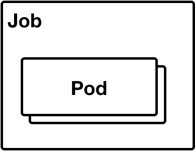
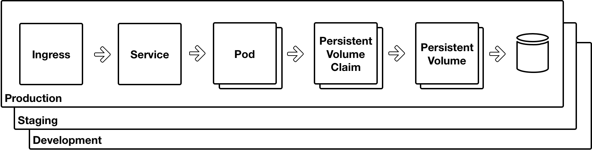

# Day Two - Kubernetes Architecture

---

In this section we will do a quick whistle stop tour of _Kubernetes_ architecture.

---

## Kubernetes Processes

There is a core set of _Kubernetes_ processes that form the cluster runtime.  These are.

* kube-apiserver
* kube-controller--manager
* kube-scheduler
* kube-proxy
* kubelet

## Kubernetes Concepts

Before describing _Kubernetes Resources_ there is some important conceptual information to cover.

### Labels and Selectors

## Kubernetes Resources

_Resources_ are high level abstractions that contain the declarative state for an infrastructure component.  _Resources_ are published into the _Kubernetes_ API server and it is the responsibility of _Kubernetes_ controllers to bring the cluster into agreement with the declared state.  

There are many different types of _Resources_ available.  The full list of _Resources_ can be found in the [API documentation](https://kubernetes.io/docs/reference/generated/kubernetes-api/v1.10/).  The following sections describe just a few of the most important _Resources_.

**Note**

This is really just a high level introduction.  More detailed information about some of these _Resource_ types will be provided as the course unfolds.

### Pods

As described previously, a [_Pod_](https://kubernetes.io/docs/concepts/workloads/pods/pod-overview/) is the fundamental unit of execution in _Kubernetes_.  A _Pod_ has one or more containers.  The following diagram depicts a _Pod_ and the three types of containers that it can have.

| Container Type    | Description                   |
|:------------------|:------------------------------|
| **Application** | This is the core container for the application.  You need one of these and it is the comman case that a _Pod_ only contains this application container. |
| **Sidecar** | A _Pod_ can also have other containers that perform useful work in support of the application container.  A container that ships application logs is a good example. There can be any number of these within a _Pod_. |
| **Init** | Sometimes it is necessary to do some initialisation before starting the application container.  For instance, to create a database.  There can be any number of these with a _Pod_ and they are run one at a time in sequential order.  See [here](https://kubernetes.io/docs/concepts/workloads/pods/init-containers/) for more information. |

As with other _Resource_ types, a _Pod_ can have labels.  And these labels are used by other _Resources_ (see next section) to enable management of _Pods_.

### Deployments

### DaemonSet

### StatefulSet

### Job

### CronJob

### Service

### Ingress

### ConfigMap

### Secret

### PersistentVolume and PersistentVolumeClaim

### NameSpace

This is where we put it all together.

## Scratch

This is a brief coverage of the Kubernetes architecture.  Lineks for more depth can nbe found here.

Distinction.  There is the architecture of the Kubernetes daemons / nodes and also the resources that drive the behaviour.  

This will cover more about the former and the resources will be described in more depth in the next section - Kubernetes Manifests.

# Next

Let's ....

[Next](02-03.md)