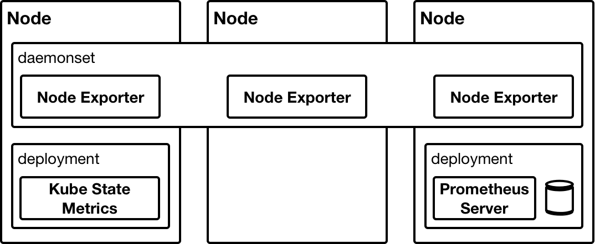

# Day Four - Prometheus

---

In this section we will will deploy [_Prometheus_](https://prometheus.io) into our cluster.  _Prometheus_ is a monitoring solution that collects metrics from endpoints and stores them in its time series database.  _Prometheus_ integrates well with _Kubernetes_ service discovery and is able to collect metrics from dynamically created endpoints without the need to constantly change its configuration.  

Something that distinguishes _Prometheus_ from other, more traditional, monitoring solutions is that it actively goes out and fetches, aka scrapes, the metrics from the endpoints that it is monitoring.  This is in contrast to the usual approach, where the monitored endpoint pushes the metrics to the server.  This approach has the benefit of allowing _Prometheus_ to scale efficiently.

---


## Overview

_Prometheus_ has a number of components.  The primary component being the _Prometheus Server_.  The _Server_ is responsible for both collecting the metrics and storing them.  Then there is the _Pushgateway_.  The _Pushgateway_ is somewhere that a short-lived job can push its metrics to before terminating.  This way its metrics can still be collected by the _Prometheus Server_ even though it no longer exists.  Finally, there is the _Alertmanager_.  This, as its name would suggest, is responsible for raising alerts based on _Prometheus_ queries.

Additional to the _core_ components of _Prometheus_ are the _Exporters_.  The _Exporters_ make available for collection the metrics from many different types of infrastructure component.  For example, the _Node Exporter_ makes available the metrics from a node.  This includes the CPU, memory, disk and NW counters.

The following diagram, taken from the _Prometheus_ [website](https://prometheus.io/docs/introduction/overview/), provides an architectural overview of the _Prometheus_ components.


## Install

To install _Prometheus_ we will use a [_Helm Chart_](https://github.com/kubernetes/charts/tree/master/stable/prometheus) from the `stable` repository.  We will also make use of a `values.yaml` file to override the default values when deploying the _Chart_.

Kube State Metrics
Nod Exporter



```console
helm upgrade --install prometheus \
  --namespace metrics \
  -f charts-values/prometheus/values.yaml \
  --version 6.10.0 \
  stable/prometheus
```


## Explore

[http://prometheus.192.168.26.11.nip.io](http://prometheus.192.168.26.11.nip.io)

Show targets

Doing a query


What we have done in this section is ...


# Next

In the next section we will ....

[Next](04-04.md)
