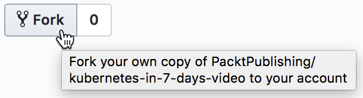
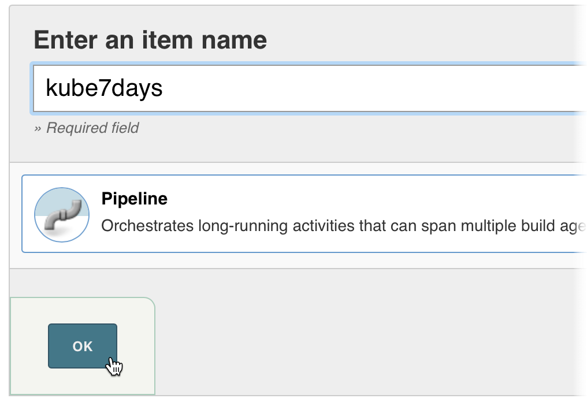
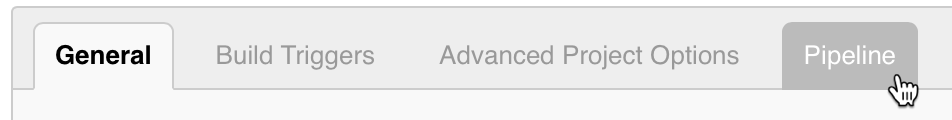
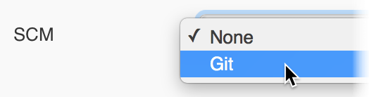
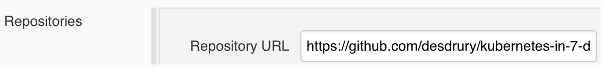
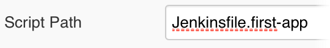

# Day Seven - Create a Pipeline

---

In this section we will create a _Pipeline_ job in _Jenkins_ to build and deploy the `first-app` we saw earlier in the course.  Smething to note is that this won't be a comprehensive pipeline example as that is out of scope for this course.  Instead we will just stick to building, pushing and deploying.  A more typical pipeline would usually include additional stages for things like tests, quality / vulnerability scans, blue / green deployments, etc.

---

The first thing we will need to do is create a fork of the Packt repo for [_Kubernetes in 7 Days_](https://github.com/PacktPublishing/kubernetes-in-7-days-video).  We will then modify the `Jenkinsfile`.

Once you have the [_Kubernetes in 7 Days_](https://github.com/PacktPublishing/kubernetes-in-7-days-video) showing in your web browser, click on the _Fork_ button.



Now, clone your fork of the repo and modify the `Jenkinsfile.first-app` file.  You will need to change all instances of `sh` commands that use `desdrury` to be your _Docker Hub_ username instead.  The `sh` commands that need to be changed are shown below.

```jenkinsfile
...
...
    sh """
      docker build \
        -t desdrury/first-app:${VERSION}.${COMMIT}  \
        -t desdrury/first-app:latest \
        .
    """
...
...
    sh "docker push desdrury/first-app:${VERSION}.${COMMIT}"
    sh 'docker push desdrury/first-app:latest'
...
...
    sh """
      helm upgrade --install first-app \
        --namespace production \
        --set image.repository=desdrury/first-app \
        --set image.tag=${VERSION}.${COMMIT} \
        --set ingress.enabled=true \
        --set ingress.hosts[0]=first-app-cicd.192.168.26.11.nip.io \
        first-app
    """
...
...
```

Once you have modified the `Jenkinsfile.first-app` you will need to check it back in.  Then we can go ahead and create a new _Pipeline_ job in _Jenkins_.

Click on the _New Item_ link in the left hand navigation pane.


Enter `kube7days` in the _Enter an item name_ field.  Click on the _Pipeline_ link.  Then click on the _OK_ button.




You will then be taken to the job definition page.  On the tab bar click on _Pipeline_ and the screen will scroll to the _Pipeline_ section.



From the _Definition_ field drop down list select _Pipeline script from SCM_.


From the _SCM_ field drop down list select _Git_.



In the _Repository URL_ field add the fork you created earlier.



And ensure that the _Script Path_ field has a value of `Jenkinsfile.first-app`.



Finally, click the _Save_ button.


You will then be taken to the job page where you can now click the _Build Now_ button and test out your pipeline.


When we run the pipeline a new _Pod_ will be created with the containers we defined in the `Jenkinsfile.first-app`, as shown below.

```console
kubectl describe pod jenkins-slave-1mhfr-hhzm1

...
...
Events:
  Type    Reason     Age   From               Message
  ----    ------     ----  ----               -------
  Normal  Scheduled  3m    default-scheduler  Successfully assigned jenkins/jenkins-slave-1mhfr-hhzm1 to node1
  Normal  Pulling    3m    kubelet, node1     pulling image "lachlanevenson/k8s-helm:v2.8.1"
  Normal  Pulled     3m    kubelet, node1     Successfully pulled image "lachlanevenson/k8s-helm:v2.8.1"
  Normal  Created    3m    kubelet, node1     Created container
  Normal  Started    3m    kubelet, node1     Started container
  Normal  Pulling    3m    kubelet, node1     pulling image "docker:17.12.1-ce"
  Normal  Pulled     2m    kubelet, node1     Successfully pulled image "docker:17.12.1-ce"
  Normal  Created    2m    kubelet, node1     Created container
  Normal  Started    2m    kubelet, node1     Started container
  Normal  Pulling    2m    kubelet, node1     pulling image "jenkins/jnlp-slave:alpine"
  Normal  Pulled     1m    kubelet, node1     Successfully pulled image "jenkins/jnlp-slave:alpine"
  Normal  Created    1m    kubelet, node1     Created container
  Normal  Started    1m    kubelet, node1     Started container
```


What we have done in this section is fork the Packt _Kubernetes in 7 Days_ repo.  Made changes to `Jenkinsfile.first-app`.  Defined a pipeline in _Jenkins_.  And then run our pipeline to test it.


# Next

In the next section we will do some homework.

[Next](07-06.md)
